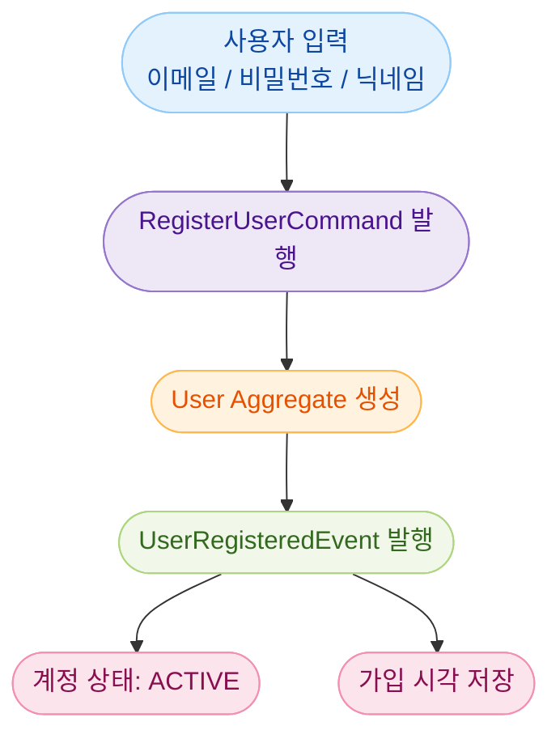
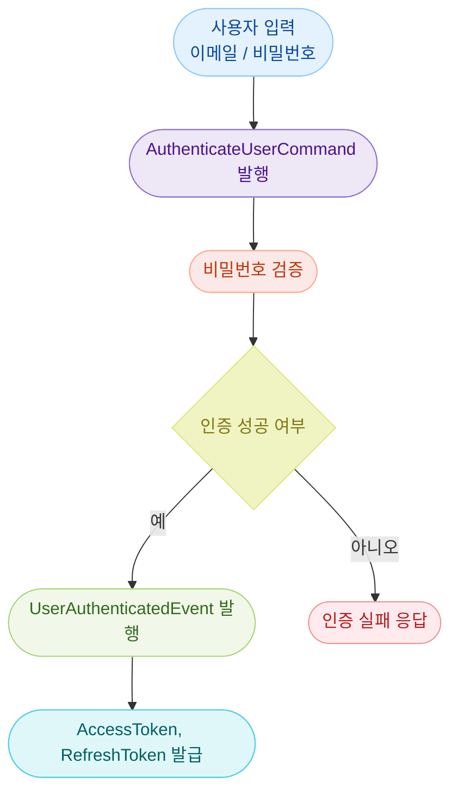
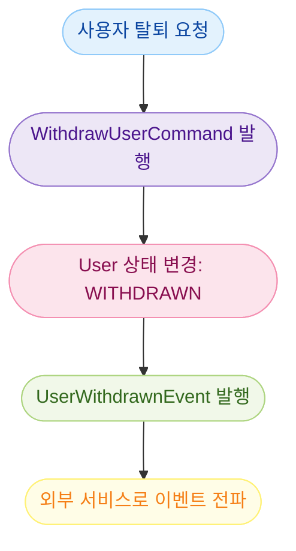

```mermaid
graph TD
  root["나 (10년차 개발자)"]

  root --> tech["기술 스택 (Tech Stack)"]
  tech --> mainTech["주력 기술"]
  mainTech --> frontend["Frontend"]
  frontend --> htmlcss["HTML/CSS/jQuery"]
  mainTech --> backend["Backend"]
  backend --> spring["Spring Boot"]
  backend --> java["Java"]
  mainTech --> db["Database"]
  db --> mysql["MySQL"]
  db --> oracle["Oracle"]
  db --> tibero["Tibero"]
  mainTech --> infra["DevOps / Infra"]
  infra --> jenkins["Jenkins"]
  infra --> tomcat["Tomcat"]
  infra --> git["Git"]
  infra --> svn["SVN"]
  tech --> myTech["💻 경험한 기술 👉"]
  tech --> myStudy["📚 공부하고 있는 기술 👉"]

  root --> projects["프로젝트 경험"]
  projects --> project1["고객센터 채팅 솔루션 개발 및 구축"]
  projects --> project2["고객센터 지식관리 솔루션 개발 및 구축"]
  projects --> project3["고객센터 감성분석 솔루션 구축"]

  root --> roles["역할 및 기여"]
  roles --> pl["PL / 개발 리더"]
  roles --> design["설계 및 리뷰"]
  roles --> performance["성능 개선"]
  roles --> security["보안 강화"]

  root --> solution["문제 해결 / 성과"]
  solution --> bottleneck["트래픽 병목 해결"]
  solution --> solution1["성능 개선"]
  solution --> issuefix["장애 대응"]
  solution --> testauto["테스트 자동화"]

  root --> growth["성장 경험"]
  growth --> study["사이드 공부"]
  study --> study_architecture["아키텍처"]
  study --> study_TDD["TDD"]
  growth --> blog["블로그 운영(티스토리) 👉"]
  growth --> cert["자격증 (정보처리기사 등)"]
  growth --> studygroup["스터디/컨퍼런스 참여"]
  growth --> codingtest["코딩테스트"]
  codingtest --> programmers["프로그래머스 👉"]
  codingtest --> codility["코딜리티 👉"]
  codingtest --> acmicpc["백준"]
  codingtest --> testDome["테스트돔"]

  root --> collab["협업 경험"]
  collab --> designCollab["기획/디자인 협업"]
  collab --> tools["Notion, Slack 등 도구"]

  root --> goal["향후 목표"]
  goal --> arch["아키텍처 설계 능력 강화"]
  goal --> scale["대용량 트래픽 처리 기술"]

```

# User Service 도메인 모델링

## 1. 유비쿼터스 언어

### 1) 용어 사전

| 한글 용어         | 영문명(Key Name)         | 설명 |
|------------------|--------------------------|------|
| 회원              | user                     | 서비스를 이용하는 사용자 |
| 회원 식별자        | userIdentifier           | 고유한 사용자 ID (PK) |
| 이메일            | email                    | 로그인 및 중복 확인에 사용되는 주소 |
| 비밀번호          | password                 | 암호화된 로그인용 비밀번호 |
| 닉네임            | nickname                 | 사용자 공개 이름 |
| 사용자 권한        | role                     | USER, ADMIN 등 시스템 내 권한 |
| 계정 상태          | status                   | ACTIVE, INACTIVE, WITHDRAWN |
| 가입 시각          | createdDateTime          | 최초 회원 가입 시각 |
| 수정 시각          | updatedDateTime          | 마지막 회원 정보 변경 시각 |
| 로그인 요청        | login                    | 인증을 위한 사용자 요청 |
| 액세스 토큰        | accessToken              | 사용자 인증 토큰 (JWT) |
| 리프레시 토큰      | refreshToken             | 액세스 토큰 만료 시 재발급용 토큰 |

---

### 2) 도메인 모델링

- 도메인 모델링은 위 용어 사전을 바탕으로 작성하였으며, 실제 업무 흐름을 서술한 것이다.  
- 지속적으로 도메인을 탐색하여, 풍부한 도메인 모델을 작성한다.
- 용어 및 모델은 개발의 기준이 된다.

#### 회원 등록(User Registration)

- 회원(user)은 회원 식별자(userIdentifier), 이메일(email), 비밀번호(password), 닉네임(nickname), 사용자 권한(role), 계정 상태(status), 가입 시각(createdDateTime)을 가진다.
- 새로운 사용자가 회원 가입을 하면 계정 상태(status)는 기본값 `활성(ACTIVE)`으로 설정된다.
- 이메일은 시스템 내에서 고유해야 하며, 중복 확인 절차가 필요하다.
- 비밀번호는 저장 전에 반드시 암호화되어야 한다.
- 회원 가입이 완료되면 `회원등록이벤트(UserRegisteredEvent)`가 발행될 수 있다.

#### 로그인(Authentication)

- 사용자는 이메일(email)과 비밀번호(password)를 입력하여 로그인 요청(login)을 보낸다.
- 시스템은 비밀번호를 확인하고, 유효한 경우 `액세스 토큰(accessToken)`과 `리프레시 토큰(refreshToken)`을 발급한다.
- 인증이 성공하면 `회원인증이벤트(UserAuthenticatedEvent)`가 발행될 수 있다.

#### 회원 정보 수정(Update User)

- 회원은 자신의 닉네임(nickname) 또는 비밀번호(password)를 수정할 수 있다.
- 정보가 수정되면 수정 시각(updatedDateTime)이 갱신된다.

#### 회원 탈퇴(User Withdrawal)

- 회원이 탈퇴를 요청하면 계정 상태(status)는 `탈퇴(WITHDRAWN)`로 변경된다.
- 탈퇴된 회원은 시스템 접근 및 서비스 이용이 불가능하다.
- 탈퇴 시 `회원탈퇴이벤트(UserWithdrawnEvent)`가 발행되어야 하며, 이는 외부 시스템(예: 주문 서비스)과의 연동에 사용된다.

#### 회원 상태(Account Status)

- 회원은 다음 중 하나의 상태를 가진다:

| 상태           | 설명 |
|----------------|------|
| 활성(ACTIVE)    | 정상적으로 활동 중인 계정 |
| 비활성(INACTIVE) | 장기간 미접속 또는 휴면 계정 |
| 탈퇴(WITHDRAWN)  | 사용자가 자발적으로 탈퇴한 계정 |

---

#### 예시 모델 설명

> 회원(User)  
> - 회원은 회원 식별자(userIdentifier), 이메일(email), 비밀번호(password), 닉네임(nickname)을 가진다.  
> - 회원 가입 시 기본 상태는 `활성(ACTIVE)`이며, 인증 절차를 통해 토큰을 발급받는다.  
> - 회원은 자신의 정보를 수정할 수 있으며, 탈퇴 시 `탈퇴(WITHDRAWN)` 상태로 전환된다.  
> - 모든 상태 변화는 명확한 이벤트로 기록되고, 필요 시 외부 시스템으로 전달된다.

---

## 2. 바운디드 컨텍스트

### 컨텍스트 명: `UserContext`

#### 책임 (Responsibility)

- 회원 등록, 조회, 수정, 탈퇴
- 사용자 인증 처리 (로그인)
- 인증 토큰 발급 및 관리
- 회원 상태 관리 (탈퇴, 비활성화 등)

#### 포함된 하위 도메인

| 서브 도메인       | 설명 |
|------------------|------|
| 사용자 등록 도메인 | 신규 회원을 시스템에 등록 |
| 인증 도메인       | 로그인 요청, 비밀번호 검증, 토큰 발급 |
| 사용자 관리 도메인 | 프로필 조회, 수정, 탈퇴 등 정보 관리 |

#### 외부 의존성

- 인증 필터 (Spring Security / JWT)
- 이메일 중복 확인 API
- 로그인 요청 시 accessToken / refreshToken 반환

#### 인터페이스 (예정)

| 대상 | 방식 | 목적 |
|------|------|------|
| API Gateway | REST + JWT | 인증 라우팅 |
| Order 서비스 | REST | 사용자 정보 조회 (간단한 식별자/닉네임 등) |
| Event Consumer | Kafka (선택) | 탈퇴/차단 이벤트 발행 시 |

---

## 3. 이벤트 스토밍

### 주요 흐름: 회원 가입

- **Command**: `RegisterUserCommand`
- **Aggregate**: `User`
- **Event**: `UserRegisteredEvent`
- **State 변경**: `status = ACTIVE`, `createdDateTime` 설정

---

### 주요 흐름: 로그인

- **Command**: `AuthenticateUserCommand`
- **Service**: 이메일/비밀번호 확인 및 JWT 발급
- **Event**: `UserAuthenticatedEvent`
- **Side Effect**: accessToken, refreshToken 발급

---

### 주요 흐름: 회원 탈퇴

- **Command**: `WithdrawUserCommand`
- **Event**: `UserWithdrawnEvent`
- **State 변경**: `status = WITHDRAWN`

---

### 사용자 상태 값

| 상태 값     | 설명 |
|-------------|------|
| ACTIVE      | 정상 활동 중인 계정 |
| INACTIVE    | 휴면 또는 비활성 상태 |
| WITHDRAWN   | 탈퇴 처리된 계정 |

---

